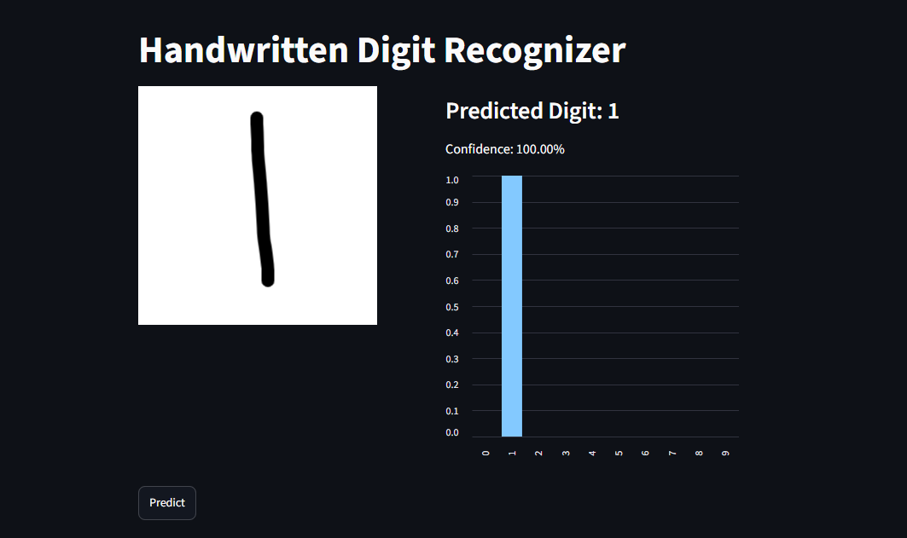
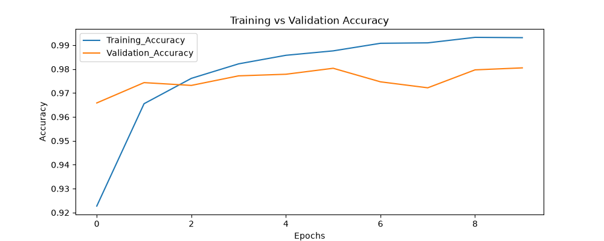
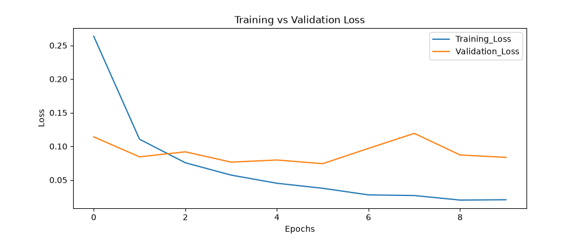
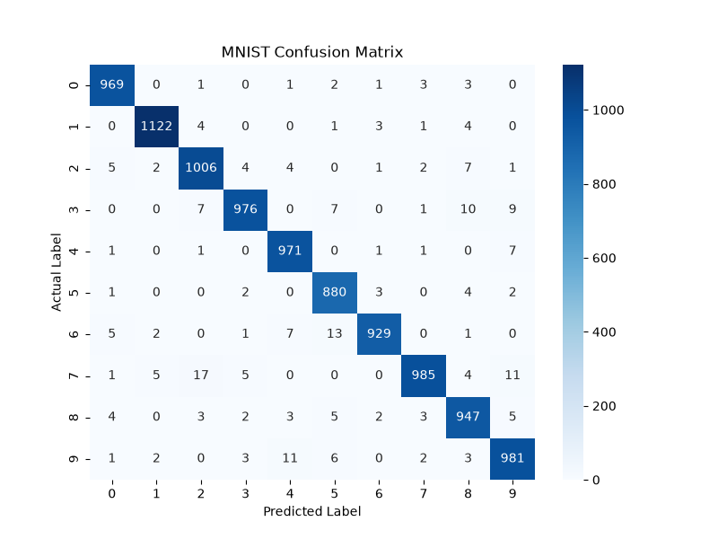
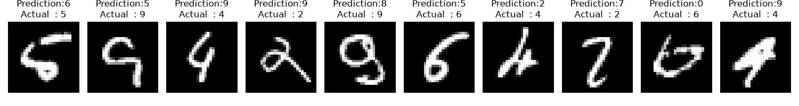

# MNIST Handwritten Digit Recognizer

A feedforward neural network trained on the MNIST dataset, with an interactive
Streamlit app that predicts digits drawn by hand in real time.

**🔗 [Live Demo](https://mnistnnproject-vnfzuwsumjurfx8vzndyzd.streamlit.app/)**



## Overview

This project follows a three-stage workflow, from experimentation to a live demo:

1. **Prototyping (Jupyter Notebook)** — data exploration, architecture experimentation, training, evaluation
2. **Production pipeline (PyCharm)** — clean, modular `.py` files implementing the finalized approach
3. **Application (Streamlit)** — a drawable canvas where the trained model predicts digits live

## Results









| Metric | Value |
|---|---|
| Test Accuracy | 97.92% |
| Test Loss | 0.0849 |

Evaluated on the standard MNIST test set (10,000 images), never seen during training.

## Architecture

| Layer | Type | Units | Activation |
|---|---|---|---|
| Input | — | 784 (28×28 flattened) | — |
| Hidden 1 | Dense | 128 | ReLU |
| Hidden 2 | Dense | 64 | ReLU |
| Output | Dense | 10 | Linear (softmax applied via loss function) |

Trained with the Adam optimizer and sparse categorical crossentropy loss
(`from_logits=True`) for numerical stability.

## Project Structure

```
mnist_nn_project/
├── .streamlit/
│   └── config.toml          # App theme
├── models/
│   └── mnist_digit_model.keras
├── Images/                  # Saved training curves, confusion matrix, misclassified samples
├── data.py                  # Load & preprocess MNIST
├── model.py                 # Build & compile the architecture
├── train.py                 # Train the model, save to disk
├── evaluate.py               # Test set evaluation, predictions
├── visualize.py               # Plotting: training curves, confusion matrix, misclassified digits
├── main.py                  # Runs the full pipeline end-to-end
├── app.py                   # Streamlit application
├── requirements.txt
└── README.md
```

## Setup

```bash
git clone <your-repo-url>
cd mnist_nn_project
pip install -r requirements.txt
```

## Usage

**Run the full training pipeline** (trains the model, saves it, generates evaluation plots):
```bash
python main.py
```

**Launch the interactive app** (uses the saved model — run `main.py` at least once first):
```bash
streamlit run app.py
```

> **Deploying to Streamlit Community Cloud:** set the Python version to **3.11**
> in Advanced Settings when creating the app, and keep `requirements.txt`
> pinned to the same TensorFlow version used to train/save the model
> (`tensorflow==2.21.0`) — a mismatch causes the saved model's Keras 3 format
> to fail deserializing on an older TensorFlow/Keras version.

Draw a digit on the canvas and click **Predict** to see the model's prediction
and confidence across all 10 classes.

## Tech Stack

- **TensorFlow / Keras** — model architecture, training
- **NumPy** — array operations, preprocessing
- **Matplotlib / Seaborn** — visualizations
- **Scikit-learn** — confusion matrix
- **Streamlit** — web app framework
- **streamlit-drawable-canvas** — the drawing widget
- **Pillow (PIL)** — image preprocessing (grayscale, resize)

## Notes

- Pixel preprocessing (normalize to [0,1], flatten to 784) is a fixed formula,
  not a fitted object — no scaler needs to be saved/reused, unlike models that
  use `StandardScaler`.
- The canvas app inverts colors and resizes drawn input to match MNIST's
  white-digit-on-black-background convention exactly.

## License

All rights reserved. This project is shared publicly for portfolio and
viewing purposes only — no license is granted for reuse, modification, or
redistribution.
